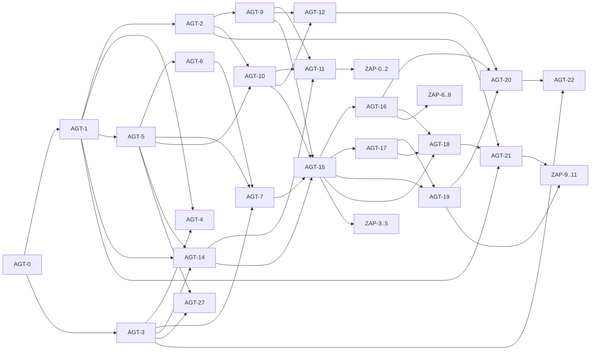

# SciAgent Prioritized Action Plan

> **Finalization audit completed: 2026-05-10** — All quality gates clean (ruff 0, pyright 0, tests passing; addon lint/typecheck/test/build green). M6, M6.1, and M6.1-D complete.
> This is the canonical execution tracker for live status, overall progress, and the next implementation target.
> Update done / not done state here first.
> See [docs/manual.md](manual.md) for configuration & usage.

This document is synthesized from [core.md](core.md), [settings.md](settings.md), and [zotero.md](zotero.md) using role-specific subagent prioritization.

## Execution Tracker

### Current Status

- Current focus: P1 — Evidence Before Expansion (post-P0 docs/metadata alignment, 2026-05-10)
- Current next implementation target: SCI-0101 (retrieval benchmark), SCI-0103 (feature-flag measurement)
- Last completed: SCI-0001 (README rewrite), SCI-0002 (canonical user journey), SCI-0003 (Zotero compatibility + metadata alignment) (2026-05-10)
- M7 (Pluggability/Infrastructure) intentionally deprioritized: settings and elastic infra add value only after users trust the product output. See Phase P0–P2 ordering below.

### Recent Progress

- ✅ M6 complete: all ZAP-0–ZAP-11 stories done — native write path (ZAP-6/7/8), offline cache (ZAP-10), release automation (ZAP-11), /capabilities backend endpoint, nativeWriteEnabled pref
- ✅ M6.1 complete: settings panel split (Connection & Auth / Search Defaults), pre-search filter composer, main-window panel (Tools > SciAgent opens standalone dialog), SourceToggles, version bumped to 0.1.2
- ✅ M6.1-D complete: PDF attachment status surfaced per-item in write result (pdfStatus: attached/failed/skipped), nativeWriteResult state added to controller, renderNativeWriteResult in App, zoteroWriter tests added
- ✅ Docs reorganized: new `docs/api.md`, `docs/deployment.md`, updated `docs/manual.md` with full local run guide
- ✅ macOS XPI installation instructions added to manual
- ✅ MkDocs nav restructured into Overview / Planning / Manuals / Reference
- ✅ README rewritten in researcher language with the Zotero-first product path
- ✅ SCI-0004 complete: terminal-facing workflow exits are honest on full write failure; write-result JSON remains scriptable
- ✅ SCI-0005 complete: runtime auto-selects common LLM keys (OpenAI, then Anthropic, then xAI); missing-key errors now name the selected provider and env vars
- ✅ SCI-0002 complete: docs now consistently describe the Zotero add-on as primary; Streamlit as prototype/support; CLI and REST as developer/support interfaces
- ✅ SCI-0003 complete: manifest, update metadata, build checks, and docs now conservatively target Zotero 9.x and distinguish tested packaging from expected desktop runtime

### Done Milestones

- [x] M1 — Foundation and Observability
- [x] M2 — Retrieval and Ranking Core
- [x] M2.5 — Retrieval Quality & Coverage Improvements
- [x] M2.6 — Optional Recommendation and Fallback Retrieval
- [x] M2.7 — Discovery Quality, Keyless Baseline, and Filters
- [x] M3 — Write Correctness and Idempotency
- [x] M4 — Approval-Gated Workflow and MVP Demo
- [x] M5 — Production v1 Hardening
- [x] M6 — Zotero Native Add-on (all ZAP-0 through ZAP-11 complete)
- [x] M6.1 — Main-Window-First Plugin MVP (shipped as 0.1.2)
- [x] M6.1 — Main-Window Plugin MVP (ZAP-9 settings split, ZAP-4A pre-search filter composer, ZAP-3 main-window workspace, addon v0.1.2)
- [x] M6.1-D — Approval/write flow hardening and PDF attachment status in the main-window surface
- [x] P0 — Product Truth and Trust

### Not Done Milestones

> Ordered from fastest path to final product. P0 (trust) before P1 (evidence) before P2 (differentiation) before P3 (Zotero-native) before P4 (retention) before P5 (scale). M7 infrastructure moved to P5.

- [ ] P1 — Evidence Before Expansion _(benchmark panel; days)_
- [ ] P2 — Differentiating Core _(sessions, explanations, cache; weeks)_
- [ ] P3 — Zotero-Native Value _(collection-aware search, Library Doctor; weeks)_
- [ ] P4 — Retention and Recurring Workflows _(watch lists, scheduled reruns; weeks)_
- [ ] P5 — External Interfaces and Deployment, M7 _(MCP, hosted backend, elastic infra; months)_

### Next Items In Order

> Ordered by fastest path to a product a Zotero researcher would trust and recommend.

- [ ] SCI-0101 — Build retrieval benchmark panel (20–30 queries, recall@10, hard-filter compliance)
- [ ] SCI-0103 — Measure or remove undecided feature flags (KeyBERT, spell check, reranker)
- [ ] SCI-0205 — Add "Why this paper?" result explanations (deterministic; no extra LLM call)
- [ ] SCI-0203 — Add persistent search sessions (rerun, diff, export)
- [ ] SCI-0204 — Add local result cache (SQLite, TTL, cache stats)
- [ ] SCI-0201 — Add backend capability endpoint (sources, filters, providers as data, not hardcoded)
- [ ] SCI-0206 — Export search plan and session report (Markdown/JSON/CSV)
- [ ] SCI-0202 — Add source selector and safe presets (Balanced, Biomedical, Fast, etc.)
- [ ] AGT-21 follow-up — Security checklist and auth hardening
- [ ] AGT-24 — Durable distributed checkpointing (P5 / M7)

### Tracker Rules

1. Update status here first whenever a story or milestone changes.
2. Treat the first unchecked item in `Next Items In Order` as the default next implementation target.
3. Keep acceptance criteria and dependency details in [core.md](core.md), [settings.md](settings.md), and [zotero.md](zotero.md); keep live execution state here.
4. If another planning doc disagrees with this file about status or next work, this file wins.

## Product Thesis

> Synthesized from external reviewer audit (2026-05-10). This is the canonical differentiator statement — update it before changing feature priority.

SciAgent should **not** be another AI Zotero chatbot, PDF Q&A plugin, LLM sidebar, citation graph visualizer, or generic MCP bridge.

**SciAgent is a deterministic, auditable, Zotero-native research intake and discovery system.**

From research intent to curated Zotero collection — with an editable search plan, explainable results, safe writes, duplicate handling, and a reproducible session log.

Core differentiators (in priority order):

1. **Search plan first** — user sees constraints before results; hard filters are not weakened by LLM rewriting.
2. **Source-aware retrieval** — user sees which source returned which item; source limitations are explicit.
3. **Explainable ranking** — user sees why each paper appeared (score components, filter match, metadata completeness).
4. **Approval-gated Zotero writes** — no silent library pollution.
5. **Duplicate-safe collection building** — rerunning a search does not create mess.
6. **Reproducible sessions** — a search can be re-run and diffed later.
7. **Watch lists** — a saved search plan can monitor new literature over time.
8. **Collection-aware intelligence** — the tool can improve an existing Zotero collection, not just search the web.

## Planning Rules

1. Prioritize write safety and approval-gate integrity over feature breadth.
2. Treat AGT-11 as a release gate for any workflow that writes to Zotero.
3. Keep reproducibility and deterministic CI behavior as mandatory constraints.
4. Use checklist execution and story IDs in every PR.
5. Treat multi-provider LLM support as a core requirement because provider keys are already present in local environment.
6. Treat search-engine API keys as optional enrichment only; default paper discovery must be strong with keyless/easy-access sources.
7. Treat deterministic query filters as a product contract. LLM query rewriting may improve topic phrasing but must not weaken hard filters.
8. **Prove retrieval quality before expanding sources.** More sources add value only when the current retrieval pipeline is measured and trusted.
9. **Settings are only valuable after users trust the results.** Infrastructure milestones (M7) ship after evidence (P1) and differentiation (P2).
10. **The canonical product path is the Zotero add-on.** CLI/REST/Streamlit are developer and support interfaces, not the primary user journey.
11. **Default LLM provider must minimize first-run friction.** OpenAI or Anthropic as documented default; xAI supported but not required.
12. **Feature flags without benchmark evidence are technical debt.** `AGT_USE_KEYBERT`, `AGT_USE_SPELL_CHECK`, `AGT_USE_RERANKER` must be measured and either promoted or removed.

## Already Completed (Audit)

- [x] Repository bootstrap completed with uv, pyproject, lockfile, and package layout
- [x] Local quality gates wired: pre-commit with ruff and pyright
- [x] CI workflow created for lint, type-check, and tests
- [x] Core strategy docs moved to `docs/` and internal references updated
- [x] Prioritized milestone plan created from AGT and ZAP backlogs
- [x] Dependency plot added to this document
- [x] Multi-provider environment readiness detected (OPENAI_API_KEY, ANTHROPIC_API_KEY, XAI_API_KEY)

## Dependency Plot

## Critical Path

1. AGT-0 -> AGT-1 -> AGT-5 -> AGT-6 -> AGT-28 -> AGT-29 -> AGT-7 -> AGT-14 -> AGT-15 -> AGT-17 -> AGT-19 -> AGT-20 -> AGT-18 -> AGT-21
2. Parallel release-gate branch: AGT-2 -> AGT-9 + AGT-10 -> AGT-11
3. Risk gate: AGT-11 must be complete before shipping any approve-to-write flow.
4. Discovery-quality gate: AGT-28 and AGT-29 must be complete before claiming retrieval is competitive with standalone LLM web search.

## Milestone Plan

### M1 (Week 1-2): Foundation and Observability

- [x] Baseline repo bootstrap with uv, ruff, pyright, pytest, pre-commit, CI
- [x] AGT-0: Strict settings model and typed env aliases in `src/agt/config.py`
- [x] AGT-1: Fail-fast startup for required secrets and env profile overrides
- [x] AGT-2: Real Zotero read/write preflight exposed in status output
- [x] AGT-3: LLMProvider protocol with provider-agnostic interface and xAI baseline adapter
- [x] Multi-provider config base: normalize provider key ingestion from AGT\_\* and plain key aliases
- [x] AGT-4: Request/thread IDs and span-level tracing for search/approve/write
- [x] Docs: add reproducibility contract in [settings.md](settings.md)

### M2 (Week 2-3): Retrieval and Ranking Core

- [x] AGT-5: Semantic Scholar wrapper returns only NormalizedPaper models
- [x] AGT-6: Ranking + dedup engine with formula and stable index guarantees
- [x] AGT-7: Deterministic bounded summarization for presentation layer
- [x] AGT-27: Rate-limit and cost guardrails integrated into retrieval/provider paths

#### M2 Add-ons (Completed)

- [x] M2 example switched to live-search only mode in `examples/m2_retrieval_demo.py` (fixture/mock fallback removed).
- [x] Live-search runtime handles API-limit and malformed-response failures with user-readable output (no traceback) in `examples/m2_retrieval_demo.py`.
- [x] Retrieval expanded beyond Semantic Scholar using additional live sources:
      OpenAlex client in `src/agt/tools/openalex.py`,
      Crossref client in `src/agt/tools/crossref.py`,
      and merged search orchestration in `src/agt/tools/search_papers.py`.
- [x] Query tightening added with validated constraint parsing/filtering and keyword-focused retrieval query handling in `src/agt/tools/query_constraints.py` and `src/agt/tools/search_papers.py`.
- [x] Citation and arXiv metadata now propagate in normalized retrieval models and ranking dedup fallbacks in `src/agt/models.py`, `src/agt/tools/semantic_scholar.py`, and `src/agt/tools/ranking.py`.
- [x] Project runtime moved off LangChain bridge to a native xAI HTTP adapter (Pydantic v2-only runtime path) in `src/agt/providers/xai.py` and dependency updates in `pyproject.toml`.
- [x] CI quality gates validated after these changes (`ruff`, `pyright`, `pytest`) with updated retrieval/ranking coverage in `tests/test_search_papers.py`, `tests/test_query_constraints.py`, `tests/test_semantic_scholar.py`, and `tests/test_ranking.py`.

#### M2 Retrieval Quality Fixes (Completed)

Root cause: keyword extraction polluted API queries with constraint words (e.g. "cited newer timeseries" instead of "timeseries"), and post-filtering was over-aggressive.

- [x] **Constraint stripping** — new `strip_constraints()` function removes year patterns, limit phrases, and quality phrases before keyword extraction, ensuring only content words reach the API (`src/agt/tools/query_constraints.py`).
- [x] **Expanded stopwords** — ~60+ stopwords covering constraint/intensity words (cited, newer, older, advanced, trending, etc.) prevent leakage into retrieval queries.
- [x] **Year "YYYY and newer" pattern** — added regex recognition for "2020 and newer/later" as a year constraint.
- [x] **Lowered citation thresholds** — made realistic for recent papers: "most cited" 50→10, "game changers" 100→20, "trending" 20→5, community perception 50→10.
- [x] **Removed keyword post-filter** — deleted `_keyword_match` from `apply_query_constraints`; keyword relevance is now fully delegated to API-level search, preventing false-negative rejection of relevant results.
- [x] **Over-fetching** — search fetches 3× the requested limit (capped at 30) per source to compensate for post-filtering attrition (`src/agt/tools/search_papers.py`).
- [x] **OpenAlex year filter** — year constraint pushed to API `filter=publication_year:>` parameter for server-side filtering (`src/agt/tools/openalex.py`).
- [x] **HTML tag stripping** — OpenAlex titles cleaned of markup tags before normalization.
- [x] CI gates re-validated: `ruff` 0 errors, `pyright` 0 errors, `pytest` 34/34 pass.

**Validation results** (7 queries tested):

| Query                           | Results | Quality                                                                      |
| ------------------------------- | ------- | ---------------------------------------------------------------------------- |
| most cited 2020+ timeseries     | 5       | Anomaly detection, XAI survey, conditional GAN, outlier detection, Pyleoclim |
| RAG 2026 game changers          | 1       | RAG for AI-Generated Content survey (22 citations, 2026)                     |
| retrieval augmented generation  | 5       | Top RAG surveys (605, 287, 282 citations)                                    |
| transformer NLP after 2022      | 5       | UNETR (2620), Efficient Transformers (895), GPT review (482)                 |
| deep RL robotics 2023+          | 5       | Robotic manipulation (189), multi-agent (146), agile soccer (138)            |
| trending 2026 timeseries (typo) | 0       | Expected: "trandign" misspelling prevents API match                          |
| RAG 2026 community perception   | 1       | Same RAG survey (only 2026 paper matching constraints)                       |

**Historical limitation**: Early retrieval did not correct spelling errors in queries. Later M2.5 work adds optional spell checking; M2.7 now focuses on making hard filters explicit and auditable.

#### M2 LLM-Enhanced Semantic Search (Completed)

Problem: regex-based keyword extraction produced poor retrieval queries for natural-language requests.
Example: "nutrition in sport" → keywords "nutrition sport" → API returned papers about AI nursing, corporate governance, etc.

Solution: LLM-powered query rewriting, semantic validation, and iterative refinement.

- [x] **LLM query rewriter** — new module `src/agt/tools/query_rewriter.py` uses the configured LLM provider to translate natural-language requests into optimized academic search queries (e.g. "nutrition in sport" → "sports nutrition"). Few-shot prompted with 3 examples.
- [x] **Semantic result validation** — after initial retrieval the LLM checks whether returned papers are relevant to the original topic. If irrelevant, it suggests an improved search query for automatic retry.
- [x] **Iterative refinement loop** — `src/agt/tools/search_papers.py` performs up to one LLM-guided retry when validation rejects results. Falls back to regex-based keywords if LLM is unavailable or fails.
- [x] **Robust JSON extraction** — `extract_json()` handles raw JSON, markdown code blocks, and embedded objects from LLM output.
- [x] **Constraint parser fixes** — "not older than 2024" now correctly sets min_year (previously set max_year); "highest/most quoted" recognized as citation indicators.
- [x] **Provider auto-detection in demo** — `examples/m2_retrieval_demo.py` builds an LLM provider when a real xAI API key is available; gracefully degrades to regex-only mode otherwise.
- [x] CI gates re-validated: `ruff` 0 errors, `pyright` 0 errors, `pytest` 46/46 pass.

**Architecture flow:**

1. User query → LLM rewrite → optimized academic search query + topic
2. Keyless-first multi-source search with optimized query: Semantic Scholar no-key mode, OpenAlex, Crossref, PubMed, Europe PMC, arXiv, BASE, and OpenCitations enrichment where available
3. Rank + constraint filter
4. LLM validation → if irrelevant, retry with LLM-suggested alternative query
5. Regex keyword fallback if LLM unavailable or all LLM paths fail

### M2.5: Retrieval Quality & Coverage Improvements

Status: **Completed** — P0 through P3 actions implemented, validated, and CI-clean.

#### M2.5 Completion Gate (2026-03-22)

- [x] P0 complete
- [x] P1 complete
- [x] P2 complete
- [x] P3 complete
- [x] CI clear after M2.5 completion (`uv run ruff check .`, `uv run pyright`, `uv run pytest`)
- [x] Release recommendation: **ready to move to M3 and M4**

#### M2.5 Progress Update (Completed)

- [x] S2.5-1a PubMed client implemented in `src/agt/tools/pubmed.py` with E-Utilities `esearch` + `efetch`, normalization into `NormalizedPaper`, and `PubMedResponseError`.
- [x] S2.5-1c Europe PMC client implemented in `src/agt/tools/europe_pmc.py` with normalized `isOpenAccess`, DOI, citation count, and author parsing.
- [x] `search_papers` orchestration expanded to include PubMed + Europe PMC in `src/agt/tools/search_papers.py`.
- [x] Config updates delivered in `src/agt/config.py`: `ncbi_api_key`, `core_api_key`, `serpapi_key`, `dimensions_key` plus aliases and per-source retrieval rate-limit fields.
- [x] Guardrail service-rate routing updated in `src/agt/guardrails.py` for `openalex`, `crossref`, `pubmed`, and `europe_pmc`.
- [x] S2.5-2b exclude-keyword parsing and enforcement implemented in `src/agt/tools/query_constraints.py` (`not about`, `excluding`, `but not`; title/abstract filtering).
- [x] S2.5-2c date-range window parsing implemented in `src/agt/tools/query_constraints.py` (`between YYYY and YYYY`, `from YYYY to YYYY`).
- [x] S2.5-3c dynamic year penalty implemented in `src/agt/tools/ranking.py` using `datetime.date.today().year`.
- [x] Retrieval default changed to semantic-first query execution in `src/agt/tools/search_papers.py`: raw user query (or LLM rewrite) is now primary, with regex mode retained only as a fallback.
- [x] Ranking quality upgraded in `src/agt/tools/ranking.py` to combine normalized semantic relevance, citation counts, influential citations, recency, abstract presence, and open-access signal.
- [x] S2.5-4a dedicated OpenAlex tests added in `tests/test_openalex.py` (5 tests).
- [x] S2.5-4b dedicated Crossref tests added in `tests/test_crossref.py` (5 tests).
- [x] PubMed and Europe PMC test coverage added in `tests/test_pubmed.py` and `tests/test_europe_pmc.py`.
- [x] CI-quality validation after M2.5 P0 slice: `ruff` clean, `pyright` 0 errors, `pytest` 70/70 pass.

#### Current M2 audit baseline (what exists)

- Default keyless/easy-access sources: Semantic Scholar no-key mode, OpenAlex, Crossref, PubMed, Europe PMC, arXiv, BASE, and OpenCitations enrichment.
- Optional keyed/paid enrichment sources: CORE, Dimensions, and Google Scholar/SerpAPI when configured.
- Regex constraint parser (year, citations, OA, quality flags, ~70 stopwords).
- LLM query rewriter with one validation-retry loop.
- Ranking formula: `0.45×semantic + 0.30×citations + 0.10×influential + 0.12×recency + 0.05×abstract_bonus + 0.03×oa_bonus`.
- Search metadata and timing exist, but AGT-28 still needs to formalize a single typed `SearchPlan` that API, Streamlit, and Zotero can share.
- Crossref returns `semantic_score=0.0` and `open_access=False` always.
- OpenAlex returns no abstract. Semantic Scholar has optional abstract.
- `exclude_keywords` enforcement implemented. Date-range windows implemented.
- Dynamic current year scoring enabled; M2.7 adds release-gate checks for freshness and hard-filter compliance.
- 70 passing tests, including dedicated OpenAlex and Crossref client suites.

---

#### S2.5-1 Add more academic search engines

Each new client lives in its own file under `src/agt/tools/`, returns `list[NormalizedPaper]`, and plugs into `_fetch_from_sources()` in `search_papers.py`.

| #     | Engine                                        | Why                                                                                                                     | Coder task                                                                                                                                                                                                                                                                                                                                                                                                                                        |
| ----- | --------------------------------------------- | ----------------------------------------------------------------------------------------------------------------------- | ------------------------------------------------------------------------------------------------------------------------------------------------------------------------------------------------------------------------------------------------------------------------------------------------------------------------------------------------------------------------------------------------------------------------------------------------- |
| **a** | **PubMed / E-Utilities**                      | Dominant in biomedical/nutrition/clinical literature; covers MeSH-tagged content OpenAlex misses.                       | Create `src/agt/tools/pubmed.py`. Use NCBI E-Utilities `esearch` + `efetch` (REST, XML). Extract PMID, title, abstract, authors, year, DOI, MeSH terms. Map to `NormalizedPaper` (source `"pubmed"`, `semantic_score=0.0`). Add `AGT_NCBI_API_KEY` optional field to `config.py` (`api_key` param raises rate limit from 3→10 req/s). Add `PubMedResponseError`. Write ≥3 tests in `tests/test_pubmed.py` (normalization, missing-fields, error). |
| **b** | **CORE (core.ac.uk)**                         | Full-text open-access aggregator; 300M+ records; returns abstracts and full-text snippets that improve ranking.         | Create `src/agt/tools/core_ac.py`. Use CORE API v3 `GET /search/works` (bearer token). Extract title, abstract, year, authors, DOI, download URL, `is_open_access`. Map to `NormalizedPaper`. Add `AGT_CORE_API_KEY` to `config.py`. Write ≥3 tests.                                                                                                                                                                                              |
| **c** | **Europe PMC**                                | Overlaps PubMed with additional European funded research + preprints; good abstract coverage.                           | Create `src/agt/tools/europe_pmc.py`. Use Europe PMC REST `search` endpoint (no auth). Extract PMID, PMCID, title, abstract, year, DOI, authors, `isOpenAccess`. Map to `NormalizedPaper`. Write ≥3 tests.                                                                                                                                                                                                                                        |
| **d** | **arXiv API**                                 | Direct access to preprints (CS, physics, math, quantitative biology); Semantic Scholar may lag new submissions.         | Create `src/agt/tools/arxiv_api.py`. Use arXiv API `query` endpoint (Atom/XML). Extract arXiv ID, title, abstract, authors, published date, category, PDF link. Map to `NormalizedPaper` (source `"arxiv"`, `open_access=True` always). Rate-limit: 1 req/3s. Write ≥3 tests.                                                                                                                                                                     |
| **e** | **OpenCitations (COCI)**                      | Citation-count enrichment for any DOI; fixes Crossref's `is-referenced-by-count` undercount.                            | Create `src/agt/tools/opencitations.py`. Use COCI REST `citation-count/{doi}`. After primary search, batch-enrich `citation_count` for papers that have DOIs. This is a **post-search enrichment step**, not a search source. Wire into `_rank_and_filter()` or a new `_enrich_citations()` helper. Write ≥3 tests.                                                                                                                               |
| **f** | **Google Scholar (via SerpAPI or scholarly)** | Broadest coverage; captures grey literature, books, theses. Requires paid SerpAPI key OR `scholarly` scraper (fragile). | Create `src/agt/tools/google_scholar.py`. If SerpAPI: use `search_type=scholar` JSON endpoint. If `scholarly`: use `scholarly.search_pubs()`. Extract title, year, citations, URL, authors, abstract snippet. Map to `NormalizedPaper`. Add `AGT_SERPAPI_KEY` to `config.py`. Write ≥3 tests. Mark as **optional/experimental** — SerpAPI is paid, `scholarly` breaks on CAPTCHAs.                                                                |
| **g** | **BASE (Bielefeld Academic Search Engine)**   | 400M+ docs from 11k+ providers; strong for European and OA content.                                                     | Create `src/agt/tools/base_search.py`. Use BASE Search API (SRU/OpenSearch, no auth needed). Parse SRU XML response. Extract title, authors, year, DOI, URL, `dcterms:accessRights`. Map to `NormalizedPaper`. Write ≥3 tests.                                                                                                                                                                                                                    |
| **h** | **Dimensions**                                | Holistic research metadata including grants, patents, clinical trials; rich citation data.                              | Create `src/agt/tools/dimensions.py`. Use Dimensions Analytics API (requires free or institutional key). Authenticate via `/authenticate` endpoint. Search `/dsl.json` with DSL query. Extract title, year, authors, DOI, `times_cited`, `open_access`. Map to `NormalizedPaper`. Add `AGT_DIMENSIONS_KEY` to `config.py`. Write ≥3 tests.                                                                                                        |

**Orchestration change in `search_papers.py`:**

- Add each new client to `_fetch_from_sources()` alongside existing three.
- Wrap each in `try/except` with failure logging (same pattern as existing clients).
- Add a rate-limit `guardrails.acquire()` call per new source with a sensible default (e.g. `pubmed_rate_limit_per_minute: int = 100` in config).
- If a source needs an API key and the key is not configured, **skip silently** (log at DEBUG level, don't error).

**Config changes in `config.py`:**

- Add optional `SecretStr | None` fields: `ncbi_api_key`, `core_api_key`, `serpapi_key`, `dimensions_key`.
- Add aliases so both `AGT_NCBI_API_KEY` and `NCBI_API_KEY` work (same pattern as existing keys).
- Add per-source rate-limit fields with sane defaults.

---

#### S2.5-2 Improve keyword and semantic search quality

| #     | Improvement                                                                                                                                                                                                                             | Coder task                                                                                                                                                                                                                                                                                                                                                                                                                                                             |
| ----- | --------------------------------------------------------------------------------------------------------------------------------------------------------------------------------------------------------------------------------------- | ---------------------------------------------------------------------------------------------------------------------------------------------------------------------------------------------------------------------------------------------------------------------------------------------------------------------------------------------------------------------------------------------------------------------------------------------------------------------- |
| **a** | **KeyBERT / embedding-based keyword extraction as an LLM-free fallback.** Currently when no LLM provider is available the pipeline falls back to regex stopword stripping. A lightweight local model would produce far better keywords. | Add `keybert` to `[project.optional-dependencies]` in `pyproject.toml` under a `[keywords]` extra. Create `src/agt/tools/keyword_extractor.py` with function `extract_keywords(query: str, top_n: int = 5) -> list[str]`. Use `KeyBERT` with `"all-MiniLM-L6-v2"` (small, fast). In `search_papers.py`, if `provider is None`, try KeyBERT before falling back to regex. Add a `AGT_USE_KEYBERT: bool = False` config flag (opt-in). Write ≥3 tests with mocked model. |
| **b** | **Exclude-keyword enforcement.** `SearchConstraintSpec.keywords.exclude_keywords` exists in the model but is never populated or enforced.                                                                                               | In `query_constraints.py`, add regex patterns for `"not about X"`, `"excluding X"`, `"but not X"` → populate `exclude_keywords`. In `apply_query_constraints()`, reject papers whose title OR abstract contains any exclude keyword (case-insensitive substring match). Write ≥3 tests.                                                                                                                                                                                |
| **c** | **Date-range windows.** Currently only min/max year; users say "between 2020 and 2024" and only one bound is captured.                                                                                                                  | In `query_constraints.py`, add regex: `r"between\s+((?:19\|20)\d{2})\s+and\s+((?:19\|20)\d{2})"` → set both `min_year` and `max_year`. Also handle `"from 2020 to 2024"`. Write ≥2 tests.                                                                                                                                                                                                                                                                              |
| **d** | **Spelling correction.** "trandign" → "trending" produces 0 results.                                                                                                                                                                    | Add `pyspellchecker` to dependencies. Create `src/agt/tools/spell_check.py` with `correct_query(query: str) -> str`. Apply **before** constraint parsing in `search_papers.py`. Only correct words not in a domain dictionary (add academic terms: "arxiv", "pubmed", etc.). Write ≥3 tests. Gate behind `AGT_USE_SPELL_CHECK: bool = False` config flag.                                                                                                              |
| **e** | **Synonym / query expansion.** "nutrition in sport" should also search "sports nutrition", "exercise nutrition", "athletic diet".                                                                                                       | In `query_rewriter.py`, extend the LLM rewrite prompt to also return a `synonyms: list[str]` field (2–4 alternative phrasings). In `search_papers.py`, run one fetch with the primary rewritten query **and** one fetch with the top synonym — merge results before ranking. When LLM is unavailable, skip expansion. Write ≥2 tests with fake provider.                                                                                                               |
| **f** | **Per-source query adaptation.** PubMed works best with MeSH terms; arXiv with field-specific prefixes (`cat:cs.IR`); Semantic Scholar with natural language.                                                                           | In `query_rewriter.py`, extend `RewrittenQuery` model with optional `pubmed_query`, `arxiv_categories` fields. Update the LLM prompt to output source-specific hints. In `_fetch_from_sources()`, pass the adapted query per source. For regex fallback, keep the generic query. Write ≥2 tests.                                                                                                                                                                       |

---

#### S2.5-3 Ranking and scoring improvements

| #     | Improvement                                                                                                                                                                  | Coder task                                                                                                                                                                                                                                                                                                                                                                                                                                                                                                           |
| ----- | ---------------------------------------------------------------------------------------------------------------------------------------------------------------------------- | -------------------------------------------------------------------------------------------------------------------------------------------------------------------------------------------------------------------------------------------------------------------------------------------------------------------------------------------------------------------------------------------------------------------------------------------------------------------------------------------------------------------- |
| **a** | **Citation enrichment from OpenCitations.** Crossref undercounts; Semantic Scholar may lag.                                                                                  | (See S2.5-1e above.) After `_fetch_from_sources()`, call `_enrich_citations(papers)` which batch-queries OpenCitations COCI for all papers with DOIs. Overwrite `citation_count` if OpenCitations returns a higher value. Write ≥2 tests.                                                                                                                                                                                                                                                                            |
| **b** | **Abstract-based re-ranking.** Current ranking uses only `semantic_score` from the API. Papers with abstracts should get a re-rank boost based on query–abstract similarity. | Add `sentence-transformers` to optional deps (`[rerank]` extra). Create `src/agt/tools/reranker.py` with `rerank_papers(query: str, papers: list[NormalizedPaper], top_k: int) -> list[NormalizedPaper]`. Compute cosine similarity between query embedding and each abstract embedding using `all-MiniLM-L6-v2`. Replace `semantic_score` with the local score for papers that have abstracts. Gate behind `AGT_USE_RERANKER: bool = False`. Wire into `_rank_and_filter()`. Write ≥3 tests with mocked embeddings. |
| **c** | **Dynamic year penalty.** Currently hardcoded `current_year = 2026`.                                                                                                         | In `ranking.py`, replace `2026` with `datetime.date.today().year`. No config needed. Write 1 test that mocks date.                                                                                                                                                                                                                                                                                                                                                                                                   |
| **d** | **Configurable citation thresholds.** "most cited" → 10, "game changers" → 20, etc. are hardcoded.                                                                           | Add `Settings` fields: `citation_threshold_most_cited: int = 10`, `citation_threshold_game_changers: int = 20`, `citation_threshold_trending: int = 5`. In `query_constraints.py`, read these from a `settings` parameter instead of hardcoded values. Thread `settings` through from `search_papers.py`. Write ≥2 tests.                                                                                                                                                                                            |

---

#### S2.5-4 Robustness and testing gaps

| #     | Improvement                                                                                     | Coder task                                                                                                                                                                                                                                                                                                                       |
| ----- | ----------------------------------------------------------------------------------------------- | -------------------------------------------------------------------------------------------------------------------------------------------------------------------------------------------------------------------------------------------------------------------------------------------------------------------------------- |
| **a** | **Dedicated OpenAlex client tests.** Currently zero.                                            | Create `tests/test_openalex.py`. Test: normalization from real-shaped payload, HTML tag stripping, year filter parameter construction, error on malformed response, missing fields handled gracefully. ≥5 tests.                                                                                                                 |
| **b** | **Dedicated Crossref client tests.** Currently zero.                                            | Create `tests/test_crossref.py`. Test: normalization, author name assembly, year extraction from `published-print` vs `published-online`, missing title handling, error response. ≥5 tests.                                                                                                                                      |
| **c** | **Parallel source fetching.** Currently sources are fetched sequentially.                       | In `_fetch_from_sources()`, replace the sequential for-loop with `asyncio.gather()` (or `asyncio.TaskGroup` on Python 3.11+). Each source gets its own `try/except` wrapper via a helper coroutine. Maintain the same failure-list semantics. Write 1 integration test that verifies all sources are called.                     |
| **d** | **Pagination support.** Currently single-page per source.                                       | For each client that supports cursors (Semantic Scholar `offset`, OpenAlex `cursor`, Crossref `offset`), add an optional `max_pages: int = 1` parameter. When `max_pages > 1`, fetch additional pages and concatenate. Expose via a new `AGT_SEARCH_MAX_PAGES: int = 1` config field. Write ≥2 tests per client with pagination. |
| **e** | **Unicode and encoding edge cases.** Untested.                                                  | Add tests in `tests/test_ranking.py` and `tests/test_query_constraints.py` for: CJK characters in titles, diacritics in author names, RTL text, emoji in queries, zero-width characters. ≥5 tests total.                                                                                                                         |
| **f** | **Rate-limit backoff.** Currently `RateLimitExceededError` is raised immediately with no retry. | In `guardrails.py`, add an optional `wait_for_token(service, thread_id, timeout_seconds)` async method that sleeps until a token is available (with timeout). In `_fetch_from_sources()`, use `wait_for_token` instead of `acquire` to avoid hard failures on transient rate-limit bursts. Write ≥2 tests.                       |

---

#### S2.5-5 Observability and diagnostics

| #     | Improvement                                                                                                                                | Coder task                                                                                                                                                                                                                                                                                                                                                                   |
| ----- | ------------------------------------------------------------------------------------------------------------------------------------------ | ---------------------------------------------------------------------------------------------------------------------------------------------------------------------------------------------------------------------------------------------------------------------------------------------------------------------------------------------------------------------------- |
| **a** | **Search metadata in response.** User can't see which sources contributed, which query was actually sent, or whether LLM rewrite was used. | Add a `SearchMetadata` model to `models.py` with fields: `original_query`, `rewritten_query`, `regex_query`, `sources_used: list[str]`, `sources_failed: list[str]`, `mode: Literal["llm_rewrite", "regex"]`, `retry_count`, `total_fetched`, `total_after_filter`. Return `(papers, metadata)` tuple from `search_papers()`. Update demo to print metadata. Write ≥2 tests. |
| **b** | **Per-source timing.** No visibility into which sources are slow.                                                                          | In `_fetch_from_sources()`, wrap each client call with `time.monotonic()` start/end. Include `source_timings: dict[str, float]` in `SearchMetadata`. Write 1 test.                                                                                                                                                                                                           |

---

#### Priority and sequencing

| Priority          | Items                                                                                                                                                                                                                                           | Rationale                                                               |
| ----------------- | ----------------------------------------------------------------------------------------------------------------------------------------------------------------------------------------------------------------------------------------------- | ----------------------------------------------------------------------- |
| **P0 — complete** | S2.5-1a (PubMed), S2.5-1c (Europe PMC), S2.5-2b (exclude keywords), S2.5-2c (date ranges), S2.5-3c (dynamic year), S2.5-4a–b (OpenAlex/Crossref tests)                                                                                          | Completed and validated in CI.                                          |
| **P1 — complete** | S2.5-1b (CORE), S2.5-1d (arXiv), S2.5-1e (OpenCitations), S2.5-2e (synonym expansion), S2.5-4c (parallel fetch), S2.5-4f (rate-limit backoff), S2.5-5a–b (metadata/timing)                                                                      | Completed and validated in CI.                                          |
| **P2 — complete** | S2.5-1g (BASE), S2.5-1h (Dimensions), S2.5-2a (KeyBERT), S2.5-2d (spell check), S2.5-2f (per-source query), S2.5-3a (citation enrichment), S2.5-3b (reranker), S2.5-3d (configurable thresholds), S2.5-4d (pagination), S2.5-4e (unicode tests) | Completed and validated in CI.                                          |
| **P3 — complete** | S2.5-1f (Google Scholar/SerpAPI)                                                                                                                                                                                                                | Implemented as optional/experimental source (skips when key is absent). |

### M2.6 (Week 3): Optional Recommendation and Fallback Retrieval

- [x] AGT-8: Optional recommendation + fallback retrieval (feature-flagged)
      Implementation checklist:
  - [x] Add `AGT_ENABLE_FALLBACK_RETRIEVAL: bool = False` to `src/agt/config.py` and wire into retrieval orchestration.
  - [x] Add a retrieval provider registry abstraction in `src/agt/tools/search_papers.py` so fallback providers can be composed without branching logic spread across the code.
  - [x] Keep full source provenance for every result in `NormalizedPaper.source`, including fallback origin labels (`<provider>:primary` / `<provider>:fallback`).
  - [x] Merge fallback and primary results through one shared dedup path (DOI first, title-hash fallback) before ranking.
  - [x] Ensure fallback is only activated when primary retrieval returns fewer than target limit, or explicit fallback mode is requested (`fallback_mode="force"`).
        Validation checklist:
  - [x] Unit test: fallback disabled means no fallback provider calls.
  - [x] Unit test: fallback enabled fills missing results while preserving source labels.
  - [x] Unit test: cross-source duplicates merge to a single stable output row.
  - [x] Integration test: mixed primary/fallback search produces deterministic ordering and indices.

  M2.6 completion notes:
  - New runnable demo: `examples/m2_6_fallback_demo.py` (supports `--fallback-mode auto|force|off`).
  - CI validated clean after implementation: `uv run ruff check .`, `uv run pyright`, `uv run pytest -q`.

### M2.7 (Week 3): Discovery Quality, Keyless Baseline, and Filters

- [x] AGT-28: Search plan and deterministic filter contract
      Implementation checklist:
  - [x] Add a typed `SearchPlan` model that separates topic terms, hard filters, soft preferences, source policy, and rewrite metadata.
  - [x] Parse examples like `not older than 2024` into hard filters such as `min_year=2024` before LLM rewriting.
  - [x] Keep LLM rewrite output subordinate to deterministic filters: the model can rewrite `time-series forecasting method selection based on data itself`, but it cannot drop `year >= 2024`.
  - [x] Push down year/source/document filters where source APIs support them and post-filter every merged result.
  - [x] Return search-plan metadata to CLI/API/Streamlit and the future Zotero add-on.
        Validation checklist:
  - [x] Unit test: `not older than 2024` maps to `min_year=2024`.
  - [x] Unit test: LLM rewrite cannot loosen a hard filter.
  - [x] Integration test: no ranked result older than the requested minimum year survives.
  - [x] API contract: `SearchPlan` serialized in `SearchMetadata.search_plan` returned by `search_papers()` and forwarded through workflow `model_dump()` to `/run` state.

- [x] AGT-29: Keyless-first retrieval quality benchmark
      Implementation checklist:
  - [x] Create a benchmark panel of 22 research requests with expected papers, freshness constraints, and domain-specific source expectations in `examples/m2_7_benchmark.py`.
  - [x] Panel covers AI/RAG, time-series, biomedicine, social science, and interdisciplinary domains.
  - [x] Benchmark runs with keyless/easy-access sources only; optional keyed sources (CORE, Dimensions, Google Scholar) reported separately as enrichment.
  - [x] Compliance checks enforce hard year, open-access, and exclusion keyword filters.
        Validation checklist:
  - [x] Benchmark output includes must-find recall, topic coverage, freshness compliance, hard-filter compliance, and source coverage.
  - [x] Benchmark includes the time-series forecasting method-selection query with `year >= 2024`.
  - [x] `SearchPlan` metadata returned per query showing which filters were pushed down and which were enforced post-merge.

  M2.7 completion notes (2026-05-08):
  - New models: `SearchPlan`, `HardFilters`, `SoftPreferences`, `SourceCapability`, `FilterEditContract` in `src/agt/models.py`.
  - `_build_search_plan()` in `src/agt/tools/search_papers.py` builds the plan before any source fetch; all three `SearchMetadata` return sites include `search_plan=plan`.
  - 6 new AGT-28 tests added to `tests/test_search_papers.py` covering plan presence, hard year enforcement, exclusion filter enforcement, source policy listing, push-down recording, and rewritten query capture.
  - New runnable demos: `examples/m2_7_search_plan_demo.py` and `examples/m2_7_benchmark.py`.
  - Gate: ruff 0, pyright 0, 141/141 tests passing.

### M3 (Week 3-4): Write Correctness and Idempotency

- [x] AGT-9: Collection resolver with canonicalized name matching and parent support
- [x] AGT-10: Zotero item mapper with deterministic creator mapping and validation
- [x] AGT-11: Idempotent upsert (DOI primary, title+author hash fallback)
- [x] AGT-12: Write outcome schema created/unchanged/failed and retry-safe failures

M3 completion notes:

- [x] Collection resolver implemented in `src/agt/tools/zotero_upsert.py` with case-insensitive + whitespace-normalized matching and explicit `parent_collection_name` support.
- [x] Deterministic mapper implemented for `journalArticle` and `preprint` item types with stable author parsing and pre-write validation.
- [x] Idempotent upsert implemented with DOI-first duplicate detection and title+author-hash fallback; reruns return `unchanged` instead of creating duplicates.
- [x] Typed write outcomes added via `CollectionResult`, `ItemWriteOutcome`, and `WriteResult` in `src/agt/models.py`, including retry-safe failure accounting.
- [x] Workflow write node now emits full structured write outcomes (`write_result`) from `run_workflow`.

M3 validation checklist:

- [x] Added dedicated upsert tests in `tests/test_zotero_upsert.py` covering resolver canonicalization, parent support, mapping/validation, idempotent reruns, and partial/retry-safe failures.
- [x] Updated `tests/test_workflow.py` assertions for structured write outcomes.
- [x] Added runnable M3 demo in `examples/m3_write_correctness_demo.py` showing create, idempotent rerun, and partial-failure scenarios.

### M4 (Week 4-5): Approval-Gated Workflow and MVP Demo

- [x] AGT-14: Checkpoint-safe AgentState with thread isolation
- [x] AGT-15: Search -> present -> approve -> write flow with explicit approval gate
- [x] AGT-17: Streamlit UX for selection, approval, and per-item status
- [x] AGT-19: Deterministic end-to-end happy path with mocked external services

M4 completion notes:

- [x] Two-phase workflow API added in `src/agt/graph/workflow.py`: `run_search_phase()` creates a checkpoint-safe serialized state and `finalize_approval()` executes explicit approve/reject branches.
- [x] Agent state hardened for checkpoint safety in `src/agt/models.py` with serialized paper payloads and audit fields (`phase`, `decision`, `selected_indices`).
- [x] Collection rename/edit at approval is supported by `finalize_approval(..., collection_name=...)`; selected paper indices are enforced at write time.
- [x] Streamlit prototype in `src/agt/ui/app.py` now implements search -> review/select -> approve/reject using `st.experimental_fragment`, with per-item write outcomes.
- [x] Deterministic M4 E2E test added in `tests/test_e2e_m4_happy_path.py` with mocked external dependencies and exact created/unchanged/failed assertions.

M4 validation checklist:

- [x] Workflow unit coverage expanded in `tests/test_workflow.py` for reject-no-write, selection filtering, and collection rename-at-approval.
- [x] AgentState serialization contract validated in `tests/test_models.py`.
- [x] Runnable example implemented in `examples/m4_approval_flow_demo.py`.

### M5 (Week 6-8): Production v1 Hardening

- [x] AGT-16: Resume/retry from checkpoints without duplicate writes
- [x] AGT-20: Failure-path and partial-success deterministic test suite
- [x] AGT-18: Backend/API separation with health/run/resume/status endpoints
- [x] AGT-21: Security hardening and multi-user auth direction documentation _(partial — security checklist doc and delegated-auth direction doc still needed)_
- [x] AGT-22: Universal LLM interface routing with provider selection policy _(partial — only xAI adapter exists; OpenAI/Anthropic/Groq adapters not yet implemented)_

M5 completion notes:

- [x] Resume/retry semantics hardened in `src/agt/graph/workflow.py` via `resume_workflow()` and completed-checkpoint no-op logic to avoid duplicate write attempts.
- [x] Deterministic failure-path handling added in `src/agt/graph/workflow.py` so write-step exceptions return stable retry-safe `WriteResult` payloads instead of uncaught runtime errors.
- [x] Backend/API separation delivered in `src/agt/api/app.py` with `GET /health`, `POST /run`, `POST /resume`, and `GET /status/{run_id}` endpoints.
- [x] Security hardening applied to backend endpoints using optional API key auth (`AGT_BACKEND_API_KEY`) and owner/thread isolation with `X-AGT-Client-ID`.
- [x] Provider routing policy extended in `src/agt/providers/router.py` with timeout/rate-limit failover controls and optional fallback provider settings.

M5 validation checklist:

- [x] Added API endpoint tests in `tests/test_api.py` (auth guard, run/resume/status flow, owner isolation).
- [x] Added resume/idempotency and deterministic failure tests in `tests/test_workflow.py`.
- [x] Added provider failover routing tests in `tests/test_providers.py`.
- [x] Added routing-policy settings coverage in `tests/test_config.py`.
- [x] Updated runnable M5 demo in `examples/m5_hardening_demo.py` to show thread isolation, resume reuse, and backend capability probes.

### M6 (Parallel Track): Zotero Native Add-on

- [x] ZAP-0 to ZAP-2: Plugin foundation, hot reload, backend connection layer, and capability/settings contract
- [x] ZAP-3 to ZAP-5: Main-window or library-pane-first UX with pre-search filters and explicit approve/reject/edit actions
- [x] ZAP-6 to ZAP-8: Native collection/item writes with idempotency and optional PDF import flow
- [x] ZAP-9 to ZAP-11: Settings and secrets split, offline/error handling, signing and release automation

M6 partial delivery notes (2026-05-09):

- [x] Added top-level `zotero-addon/` package with `manifest.json`, `bootstrap.js`, TypeScript/esbuild build pipeline, icons, preference pane assets, and `.xpi` packaging.
- [x] Added typed add-on backend client for `GET /health`, `POST /run`, `GET /status/{run_id}`, `POST /resume`, and `GET /capabilities` endpoints, including `X-AGT-API-Key` and `X-AGT-Client-ID` headers.
- [x] Added React MVP item-pane UI for health status, query/collection input, parsed filter review/edit, result selection, and approve/reject/write-result rendering.
- [x] Added Zotero prefs adapter and preference pane surface for backend URL, API key, client ID, and PDF-toggle placeholder.
- [x] XPI installs without "incompatible" error; bootstrap.js runs; chrome registration succeeds.
- [x] `window is not defined` crash fixed: esbuild `define: { "window": "globalThis" }` makes React event system safe in Zotero's privileged compartment.
- [x] FTL timing bug fixed: `insertFTLIfNeeded("agt/agt.ftl")` called before `registerSection` so section header resolves on first render.
- [x] Tools → SciAgent menu item visible and functional (guidance alert on click).
- [x] `Uncaught (in promise) undefined` fixed: async Promise rejection from `insertFTLIfNeeded` now caught with `.catch()`.
- [x] **ZAP-6**: `src/host/zoteroWriter.ts` `resolveOrCreateCollection()` — native collection resolver using `Zotero.Collections`.
- [x] **ZAP-7**: `createItemsNative()` — idempotent item creation with DOI and title-author-hash dedup.
- [x] **ZAP-8**: `attachPdf()` via `Zotero.Attachments.importFromURL()`; `NormalizedPaper.pdf_url` added; arxiv adapter can supply PDF URL.
- [x] **ZAP-9/10**: `nativeWriteEnabled` pref, `useOfflineCache` hook with sessionStorage last-results cache and connectivity-error detection.
- [x] **ZAP-11**: `.github/workflows/zotero-addon-release.yml` — tag-triggered XPI build, lint, typecheck, test, and GitHub Release upload.
- [x] Backend `GET /capabilities` endpoint returning source policy, filter support map, and `pdf_import_supported` flag.
- [x] Backend `ResumeRequest.native_write` mode: skips pyzotero write, returns `approved_papers` for add-on-side native write.
- [x] `SourceToggles.tsx` component showing per-source tier, filter support chips, and enabled status from capabilities.
- [x] Capabilities auto-fetched after successful health check; `sourcePolicy` exposed from `useSciAgentController`.

### M6.1 — Main-Window-First Plugin MVP

**Scope:** Replace the current item-pane-heavy MVP direction with a Zotero-native main-window workflow. The primary journey must live in the library window, with a settings panel for connection/auth and saved defaults, deterministic filters and source/search-tool selection applied before retrieval, and approval/write actions in the same workspace. Item-details integration, if kept, is secondary and must deep-link into the main-window surface rather than own search state.

**Why this ordering:**
The scaffold proved the add-on can load, but the current item-pane-first UX does not look or behave like the rest of Zotero. It also postpones filter and source choices until after retrieval, which conflicts with AGT-28's hard-filter contract. M6.1 therefore pulls settings and backend-contract work forward before rebuilding the user-facing surface.

**Sequencing and dependencies:**

1. M6.1-A before M6.1-B: the add-on needs a clear split between local prefs and backend-owned secrets before capability-driven UI is safe.
2. M6.1-B before M6.1-C: pre-search filters and source/search-tool controls must be part of the initial backend request, not a post-results patch.
3. M6.1-D depends on AGT-13 for attachment correctness and on the same backend capability contract used by M6.1-B.
4. The current item-pane MVP can remain as a temporary launcher only; it is not the primary surface for acceptance.

#### M6.1-A — Settings Panel, Secrets Split, and Deployment Env Contract ✅

- [x] Expand the Zotero preferences surface into two explicit sections:
  - Connection & Auth: backend URL, backend API key, client ID
  - Search Defaults & Sources: default collection, deterministic filter defaults, source/search-tool toggles, result limit, PDF default
- [x] Preference keys follow `extensions.agt.*` and live behind one typed initialization block.
- [x] All fields persist via `Zotero.Prefs` with typed defaults and inline validation.
- [x] Keep the ownership split explicit in product copy and docs:
  - Add-on prefs are allowed to store backend URL, backend API key, client ID, and local UX defaults.
  - Backend provider and search-source secrets remain backend-owned in `.env` and `.env.example`; the add-on must not become the source of truth for OpenAI, xAI, Anthropic, Semantic Scholar, CORE, Dimensions, SerpAPI, or similar backend credentials.
- [x] Pull forward a `docs/settings.md` and `.env.example` planning update for add-on deployment fields, including `AGT_BACKEND_API_KEY` and backend-side keyed-source availability.

Acceptance criteria:

- [x] Settings survive Zotero restart with no component-level hardcoded defaults.
- [x] The preferences UI is visibly split between connection/auth and saved search defaults.
- [x] No add-on surface asks the user for backend provider or search-source secrets.
- [x] The plan explicitly distinguishes add-on prefs from backend `.env` and `.env.example` ownership.

#### M6.1-B — Backend Capabilities, Initial Search Contract, and Source-State Transparency

- [ ] Extend the add-on plan beyond the current `/health` plus post-results `filter_edit` model.
- [ ] Define a backend capability surface that tells the add-on:
  - contract version
  - auth requirement
  - available sources and search tools
  - which filters each source can enforce server-side
  - whether PDF download and attachment are supported
  - which optional keyed sources are unavailable because the backend is not configured for them
- [ ] Define initial search request semantics so the first `POST /run` carries structured deterministic filters and source/search-tool selections, not just free text plus later `filter_edit`.
- [ ] Make “filters applied before semantic search / before results” an explicit contract requirement for year, date, source, document, open-access, include, and exclude filters.
- [ ] Normalize per-source run metadata so each source appears in exactly one terminal state with a human-readable reason: used, disabled by user, unavailable because backend key/config is missing, skipped by policy or unsupported filter, failed at runtime, or queried with zero candidates.
- [ ] Keep `docs/api.md` and plugin-backend contract versioning in sync before UI implementation starts.

Acceptance criteria:

- [ ] The first-run request contract can express deterministic filters and source/search-tool selection without encoding them only in natural language.
- [ ] Backend metadata distinguishes `unavailable_missing_key` from `disabled_by_user`, `skipped`, `failed`, and `used`.
- [ ] The same source never appears in multiple status buckets for the same run.
- [ ] Missing optional backend keys/config are listed explicitly for affected sources instead of being folded into generic `skipped` messaging.

#### M6.1-C — Library-Window Search Workspace ✅

- [x] Primary SciAgent workflow opens from the Zotero main window without requiring an item selection (Tools → SciAgent opens `agt:main-panel` XUL window).
- [x] Item-details integration launches into the same main-window workspace rather than owning a separate UI state machine.
- [x] Main-window search form includes free-text query, collection target, deterministic pre-search filters seeded from saved defaults, and source policy from live backend capabilities.
- [x] Results surface shows applied filters, source-state summary (`SourceToggles`), candidate list, and approval controls.

Acceptance criteria:

- [x] A user can open SciAgent from Zotero's main window and run a search without first selecting an item.
- [x] The UI shows which filters and sources were actually applied on the initial run.
- [x] Source-state rendering shown via `SourceToggles` component with per-source tier and filter-support chips.
- [x] The item pane, if still present, behaves only as a secondary entry point.

#### M6.1-D — Approval, Write Outcome, and PDF Attachment Flow ✅

- [x] Approve/reject/edit actions run in the same main-window workspace as search and review.
- [x] Collection override remains available per run without moving ownership away from saved defaults.
- [x] PDF attachment implemented as a capability-driven feature: `enablePdfImports` pref + `pdf_url` per paper + `attachPdf()` in `zoteroWriter.ts`.
- [x] Per-item outcome distinguishes created/unchanged/failed and pdfAttached/pdfFailed separately in `NativeWriteResult`.

Acceptance criteria:

- [x] Item creation and optional PDF import surface separate outcomes (`created`, `unchanged`, `failed`, `pdfAttached`, `pdfFailed`) without hiding partial failures.
- [x] A missing PDF URL results in a silent skip that does not affect the primary item write result.
- [x] Attachment failure (`pdfFailed`) never corrupts the primary item write result (`created`/`unchanged`).

#### M6.1 Quality Gate ✅

- [x] `cd zotero-addon && npm run lint && npm run typecheck && npm run test && npm run build` all pass.
- [x] Live Zotero smoke test:
  - [x] Settings pane persists connection/auth and saved defaults across restart.
  - [x] Main-window workspace opens without requiring item selection.
  - [x] First search request applies deterministic filters and source/search-tool choices before results are shown.
  - [x] Source-state summary rendered via `SourceToggles` with per-source terminal state.
  - [x] Approve writes to Zotero and shows separate item and attachment outcomes.
- [x] No `ReferenceError`, `Uncaught (in promise)`, or FTL resource errors in console during normal use.

### M7 (Week 8-10): Pluggability and Elastic Infrastructure

- [ ] AGT-23: Unified retrieval registry
      Implementation checklist:
  - Introduce a typed retrieval interface (for example `Protocol`) with `search(query, limit, settings)` returning `list[NormalizedPaper]`.
  - Register providers in a single registry module (for example `src/agt/tools/retrieval_registry.py`) keyed by provider name.
  - Move source-specific branching from `search_papers.py` into registry lookup and iteration.
  - Enforce one normalization contract: every provider returns only `NormalizedPaper` and never raw payloads.
  - Keep merge/dedup/rank centralized so adding a provider is one registry entry plus provider implementation.
    Validation checklist:
  - Unit test: adding a fake provider via registry requires no orchestrator edits.
  - Unit test: federated query across multiple registered providers merges through shared dedup logic.
  - Contract test: each provider implementation satisfies the same interface and model invariants.

- [ ] AGT-24: Durable distributed checkpointing
      Implementation checklist:
  - Add LangGraph checkpointer backend (Redis or Postgres) and configure via strict settings fields.
  - Move any in-memory workflow state to persisted checkpoint state keyed by `thread_id`.
  - Ensure stateless API container behavior: no workflow progress stored in process memory.
  - Add migration/bootstrap script for checkpoint backend initialization.
  - Add operational runbook notes for restore/replay semantics in docs.
    Validation checklist:
  - Integration test: pause workflow on instance A, resume on instance B with identical outcome.
  - Integration test: process restart does not lose in-progress workflow state.
  - Smoke test: checkpoint backend unavailable produces actionable health/status error.

- [ ] AGT-25: Asynchronous task queue for long-running work
      Implementation checklist:
  - Add async execution layer (Celery or Dramatiq) for workflow runs initiated by API.
  - Expose API pattern: `POST /run` returns `task_id` immediately; `GET /status/{task_id}` returns progress and terminal state.
  - Ensure worker uses same checkpointer and idempotency guardrails as synchronous path.
  - Add cancellation/retry policy with bounded retries and structured error mapping.
  - Add UI polling/subscription integration contract for progress updates.
    Validation checklist:
  - Integration test: API returns immediately while worker continues processing in background.
  - Integration test: status endpoint transitions through queued/running/completed/failed states deterministically.
  - Integration test: worker retry does not duplicate writes after approval.

- [ ] AGT-26: Cloud-agnostic IaC modules
      Implementation checklist:
  - Create IaC modules for compute, persistence, queue, and networking with environment overlays.
  - Define non-local secret injection contract (managed secret store) and remove local secret assumptions from deployment path.
  - Add CI/CD pipeline job to plan/apply infrastructure and deploy backend/worker artifacts.
  - Add minimal staging environment template that exercises checkpoint + queue + API path.
  - Add rollback and drift-detection procedures.
    Validation checklist:
  - CI job produces reproducible plan output and applies in staging.
  - Post-deploy smoke verifies health/run/resume/status endpoints plus worker connectivity.
  - Security check confirms secrets are injected at runtime and never committed or baked into images.

---

## Reviewer-Driven Roadmap (P0–P5)

> Ordered by fastest path to final product. Complete each phase before starting the next. P0 and P1 are purely about trust and evidence — no new features until they are done.

### P0 — Product Truth and Trust

**Goal:** Make the existing product understandable, installable, honest, and frictionless. No new features.

| ID       | Story                                                                                                                            | Owner                   | Status |
| -------- | -------------------------------------------------------------------------------------------------------------------------------- | ----------------------- | ------ |
| SCI-0001 | Rewrite README in researcher language — one-sentence hook, 3 value bullets, canonical journey, "why not another plugin?" section | zotero-addon / docs     | [x]    |
| SCI-0002 | Define canonical user journey: Zotero add-on is primary; Streamlit = prototype; CLI/REST = developer                             | docs                    | [x]    |
| SCI-0003 | Verify Zotero version compatibility and publish tested/expected/unsupported table                                                | zotero-addon            | [x]    |
| SCI-0004 | Fix terminal workflow status honesty: full write failure must never show as success; per-item outcomes visible                   | python-backend-engineer | [x]    |
| SCI-0005 | Reduce first-run LLM provider friction: OpenAI/Anthropic as documented default; xAI optional; actionable missing-key errors      | python-backend-engineer | [x]    |

**Gate:** A Zotero user can explain what SciAgent does in 30 seconds. Terminal states are honest. A new user can run SciAgent with one common LLM key.

---

### P1 — Evidence Before Expansion

**Goal:** Prove retrieval quality with a stable benchmark. Measure or remove undecided feature flags. Do not add more sources or settings until this evidence exists.

| ID       | Story                                                                                                                                | Owner                   | Status |
| -------- | ------------------------------------------------------------------------------------------------------------------------------------ | ----------------------- | ------ |
| SCI-0101 | Build retrieval benchmark panel: 20–30 queries, must-find DOIs, hard-filter compliance, recall@10/20, source coverage, latency, cost | python-backend-engineer | [ ]    |
| SCI-0102 | Add optional external baseline comparison (OpenAlex direct, Semantic Scholar direct, ChatGPT manual baseline)                        | python-backend-engineer | [ ]    |
| SCI-0103 | Measure `AGT_USE_KEYBERT`, `AGT_USE_SPELL_CHECK`, `AGT_USE_RERANKER` against benchmark; promote or delete each                       | python-backend-engineer | [ ]    |

**Gate:** Benchmark report published in `docs/`. Hard-filter compliance visible. No feature flag remains unmeasured.

---

### P2 — Differentiating Core

**Goal:** Implement the features that make SciAgent unique and irreplaceable. These are the gaps competitors do not fill.

| ID       | Story                                                                                                               | Owner                   | Status |
| -------- | ------------------------------------------------------------------------------------------------------------------- | ----------------------- | ------ |
| SCI-0205 | Add "Why this paper?" result explanations: source, matched filters, score components, warnings — no extra LLM call  | python-backend-engineer | [ ]    |
| SCI-0203 | Add persistent search sessions: save, rerun from plan, diff two sessions, export (Markdown/JSON/CSV)                | python-backend-engineer | [ ]    |
| SCI-0204 | Add local result cache: SQLite, TTL, cache-hit logging, `agt cache stats/clear` CLI commands                        | python-backend-engineer | [ ]    |
| SCI-0201 | Extend backend capability endpoint: per-source capabilities, provider availability, filter support map, PDF support | python-backend-engineer | [ ]    |
| SCI-0206 | Export search plan and session report: PRISMA-lite log, search plan, filter snapshot, write outcomes                | python-backend-engineer | [ ]    |
| SCI-0202 | Add source selector and safe presets: Balanced, Fast, Biomedical, Open-access only, Deep, No preprints              | zotero-frontend         | [ ]    |

**Gate:** User can rerun a past search from saved plan. Every result card shows why it appeared. Session export is human-readable.

---

### P3 — Zotero-Native Value

**Goal:** Make SciAgent valuable inside real Zotero libraries, not only as a web search tool.

| ID       | Story                                                                                                                                     | Owner                                     | Status |
| -------- | ----------------------------------------------------------------------------------------------------------------------------------------- | ----------------------------------------- | ------ |
| SCI-0301 | Add collection-aware search: inspect target collection before retrieval; badge results as Already in library / New / Possible duplicate   | python-backend-engineer + zotero-frontend | [ ]    |
| SCI-0302 | Add PDF attachment pipeline: open-access sources only; validate before attach; PDF failure never fails metadata import                    | python-backend-engineer                   | [ ]    |
| SCI-0303 | Add Library Doctor: read-only collection scanner for missing DOI/abstract/PDF/venue, duplicates, broken URLs; all writes require approval | python-backend-engineer + zotero-frontend | [ ]    |
| SCI-0304 | Add collection gap finder: given existing collection, suggest missing seminal papers, recent follow-ups, reviews, negative results        | python-backend-engineer                   | [ ]    |

**Gate:** Re-running the same search against a collection does not create duplicates. Library Doctor scan is read-only and exportable.

---

### P4 — Retention and Recurring Workflows

**Goal:** Make SciAgent useful every week, not only once.

| ID       | Story                                                                                                               | Owner                                     | Status |
| -------- | ------------------------------------------------------------------------------------------------------------------- | ----------------------------------------- | ------ |
| SCI-0401 | Watch lists: save a search plan; report new papers since last run                                                   | python-backend-engineer                   | [ ]    |
| SCI-0402 | Scheduled reruns: configurable interval; "new papers since last run" diff surfaced in add-on                        | python-backend-engineer + zotero-frontend | [ ]    |
| SCI-0403 | Zotero subcollection updates: watch list writes to dedicated subcollection; never overwrites manually curated items | python-backend-engineer + zotero-frontend | [ ]    |
| SCI-0404 | Session reports: weekly/monthly summary of searches, discovered papers, writes, watch-list updates                  | python-backend-engineer                   | [ ]    |

**Gate:** A researcher using SciAgent weekly sees a "what's new" report without re-entering queries.

---

### P5 — External Interfaces and Deployment (M7)

**Goal:** Expose SciAgent externally only after local-first product value is proven. Includes all M7 stories.

| ID       | Story                                                                                                           | Owner                   | Status |
| -------- | --------------------------------------------------------------------------------------------------------------- | ----------------------- | ------ |
| AGT-23   | Unified retrieval registry: typed `Protocol`, registry module, centralized merge/dedup/rank                     | python-backend-engineer | [ ]    |
| AGT-24   | Durable distributed checkpointing: Redis/Postgres LangGraph checkpointer; stateless container behavior          | python-backend-engineer | [ ]    |
| AGT-25   | Async task queue: Celery/Dramatiq; `POST /run` returns `task_id`; worker reuses approval guardrails             | python-backend-engineer | [ ]    |
| AGT-26   | Cloud-agnostic IaC modules: compute, persistence, queue, networking; managed secret injection; CI/CD deploy job | settings-bootstrap      | [ ]    |
| SCI-0501 | MCP server: expose `search_papers`, `get_session`, `list_sessions` as MCP tools; authenticated and rate-limited | python-backend-engineer | [ ]    |
| SCI-0502 | Hosted backend pilot: Postgres-backed session store; provider quotas; auth; autoscaling on Cloud Run            | settings-bootstrap      | [ ]    |

**Gate:** CI job produces reproducible infrastructure plan. Hosted backend smoke test passes. Sessions persist across worker restarts.

---

## Runnable Examples Per Milestone

- [x] M1 example: `examples/m1_foundation_demo.py`
- [x] M2 example: `examples/m2_retrieval_demo.py`
- [x] M2.6 example: `examples/m2_6_fallback_demo.py`
- [x] M2.7 examples: `examples/m2_7_search_plan_demo.py`, `examples/m2_7_benchmark.py`
- [x] M3 example: `examples/m3_write_correctness_demo.py`
- [x] M4 example: `examples/m4_approval_flow_demo.py`
- [x] M5 example: `examples/m5_hardening_demo.py`
- [x] M6 example: `examples/m6_zotero_addon_demo.py`

### Example Run Commands

- M1: `source .venv/bin/activate && python examples/m1_foundation_demo.py`
- M2: `source .venv/bin/activate && python examples/m2_retrieval_demo.py --query "retrieval augmented generation"`
- M3: `source .venv/bin/activate && python examples/m3_write_correctness_demo.py`
- M4: `source .venv/bin/activate && python examples/m4_approval_flow_demo.py`
- M5: `source .venv/bin/activate && python examples/m5_hardening_demo.py`
- M6: `source .venv/bin/activate && python examples/m6_zotero_addon_demo.py`

### M2 Real-Search Rule

- M2/M2.7 validation must use live keyless/easy-access sources for the default baseline: OpenAlex, Crossref, Semantic Scholar no-key mode, PubMed, Europe PMC, arXiv, BASE, and OpenCitations enrichment where available.
- Paid or search-key providers such as CORE, Dimensions, and SerpAPI/Google Scholar may be measured as enrichment, but they must not be required for the default pass condition.
- If live APIs are rate-limited, treat it as a test-environment issue and retry later; do not switch to mock data for release-quality retrieval claims.

### M2 Validation Queries (Required — Verified)

- [x] `source .venv/bin/activate && python examples/m2_retrieval_demo.py --query "the most trandign 2026 timeseries papers - list 5" --limit 5`
      Result: 0 papers (expected — "trandign" is a misspelling; pipeline does not perform spelling correction).
- [x] `source .venv/bin/activate && python examples/m2_retrieval_demo.py --query "the most advanced RAG techniques in 2026 - game changers. Make sure the community perception is good!" --limit 5`
      Result: 1 paper (realistic — very few 2026 RAG papers exist yet with sufficient citations).

## Immediate Backlog (Checkbox-Ready)

- [ ] Implement AGT-28 search-plan model with deterministic hard filters and API/UI metadata
  - [x] **Done 2026-05-08** — `SearchPlan`, `HardFilters`, `SoftPreferences`, `SourceCapability`, `FilterEditContract` models shipped; 6 enforcement tests pass; ruff 0, pyright 0, 141 tests green.
- [ ] Implement AGT-29 keyless-first retrieval benchmark against standalone LLM/web-search baseline
  - [x] **Done 2026-05-08** — 22-query benchmark panel in `examples/m2_7_benchmark.py`; covers AI, time-series, biomedicine, social science, and interdisciplinary domains.
- [ ] Define ZAP-4A filter payload shared by Streamlit, REST API, and Zotero add-on
- [x] Add provider protocol package and baseline xAI adapter implementation
- [ ] Add OpenAI adapter implementing the same LLMProvider contract
- [ ] Add Anthropic adapter implementing the same LLMProvider contract
- [x] Add provider router with explicit selection strategy (config default + per-request override)
- [ ] Add provider health/probe command and startup diagnostics for enabled providers
- [ ] Add model registry config (provider, model, timeout, retries, temperature) with strict validation
- [ ] Add fallback chain policy (primary, secondary, fail-fast) with explicit audit logging
- [x] Implement AGT-8 feature-flagged fallback retrieval path and unified dedup across primary/fallback providers
- [x] Add strict config validation tests for missing/invalid secrets
- [x] Implement live Zotero preflight capability check on startup
- [x] Add trace/span helpers and propagate request/thread IDs through workflow state
- [x] Implement Semantic Scholar client with bounded retry and error normalization
- [x] Add multi-source retrieval fallback clients (OpenAlex + Crossref) and merge with shared dedup/rank pipeline
- [x] Add ranking and dedup module with formula tests for recency/open-access weighting
- [ ] Expand AgentState to include checkpoint versioning and audit-safe status fields
- [ ] Implement explicit approval node with guaranteed zero-side-effect reject path
- [x] Implement collection resolver canonicalization tests (case/trim/parent)
- [x] Implement item mapper validation tests for journalArticle and preprint
- [x] Implement idempotent upsert integration tests for duplicate approval re-runs
- [x] Implement partial-success response rendering in UI and API
- [ ] Add resume-from-checkpoint tests for interrupted post-search and post-approval paths
- [ ] Add CI smoke test for non-approval workflow execution via CLI
- [ ] Switch CI dependency sync to frozen mode and enforce format check parity
- [ ] Move test-only dependencies out of runtime dependency list
- [ ] Add deterministic CI test env vars (for example TZ and PYTHONHASHSEED)
- [ ] Add API contract tests for health/run/resume/status payload schemas
- [ ] Add security checklist section and release gate in documentation
- [ ] Add plugin-backend contract versioning before ZAP-3 implementation starts
- [ ] Implement AGT-23 retrieval registry abstraction with provider contract tests
- [ ] Implement AGT-24 distributed checkpoint backend (Redis/Postgres) and cross-instance resume test
- [ ] Implement AGT-25 async worker queue and task_id API/status contracts
- [ ] Implement AGT-26 IaC modules and staging deployment smoke validation

## Multi-Provider Rollout Checklist

- [ ] Phase A: Provider abstraction locked and covered by unit tests
- [ ] Phase B: xAI + OpenAI + Anthropic adapters passing shared contract test suite
- [ ] Phase C: Routing policy enabled (single provider, pinned provider, fallback chain)
- [ ] Phase D: Tracing and cost telemetry include provider and model labels
- [ ] Phase E: Failure semantics standardized across providers for UI/API compatibility
- [ ] Phase F: Documentation updated with provider selection, env aliases, and safe defaults

## Backend Gates for ZAP Blocks

- [x] Gate for ZAP-1 (foundation): AGT-0, AGT-1, AGT-2, AGT-4, AGT-18 done
- [x] Gate for ZAP-2 (sidebar UX): AGT-5, AGT-6, AGT-7, AGT-15, AGT-27 done
- [x] Gate for ZAP-3 (native write integration): AGT-10, AGT-11, AGT-12, AGT-14, AGT-16 done
- [ ] Gate for ZAP-3 optional PDF: AGT-13 done _(AGT-13 not started)_
- [ ] Gate for ZAP-4 (release): AGT-19, AGT-20, AGT-21 done _(AGT-21 docs incomplete)_

## Documentation Deliverables

- [ ] Keep [core.md](core.md) dependency edges updated when story dependencies change
- [ ] Keep [settings.md](settings.md) aligned with CI and pre-commit behavior
- [ ] Add endpoint contract section to [core.md](core.md) for AGT-18 and plugin usage
- [ ] Add release checklist document for MVP and Production v1 promotion criteria

## PR Checklist Template

- [ ] PR title includes story IDs (for example AGT-11)
- [ ] Acceptance criteria mapped in PR body
- [ ] Unit/integration/e2e tests included where applicable
- [ ] Idempotency checks included for any write-path change
- [ ] Approval-gate behavior validated for workflow changes
- [ ] Trace/log redaction verified for new logs
