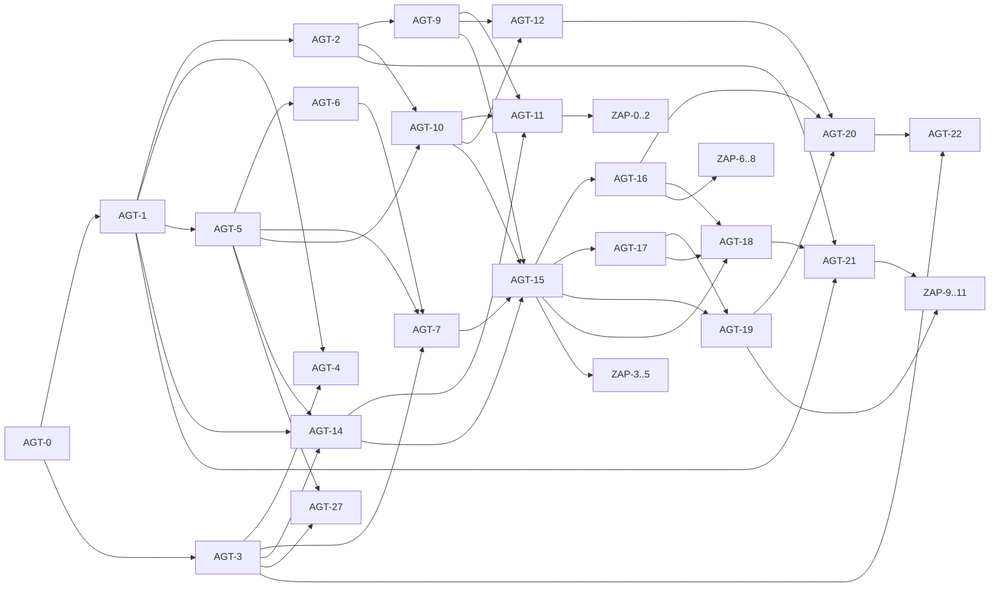

# SciAgent Prioritized Action Plan

This document is synthesized from [docs/core.md](docs/core.md), [docs/settings.md](docs/settings.md), and [docs/zotero.md](docs/zotero.md) using role-specific subagent prioritization.

## Planning Rules

1. Prioritize write safety and approval-gate integrity over feature breadth.
2. Treat AGT-11 as a release gate for any workflow that writes to Zotero.
3. Keep reproducibility and deterministic CI behavior as mandatory constraints.
4. Use checklist execution and story IDs in every PR.
5. Treat multi-provider LLM support as a core requirement because provider keys are already present in local environment.

## Already Completed (Audit)

- [x] Repository bootstrap completed with uv, pyproject, lockfile, and package layout
- [x] Local quality gates wired: pre-commit with ruff and pyright
- [x] CI workflow created for lint, type-check, and tests
- [x] Core strategy docs moved to `docs/` and internal references updated
- [x] Prioritized milestone plan created from AGT and ZAP backlogs
- [x] Dependency plot added to this document
- [x] Multi-provider environment readiness detected (OPENAI_API_KEY, ANTHROPIC_API_KEY, XAI_API_KEY)

## Dependency Plot

## Critical Path

1. AGT-0 -> AGT-1 -> AGT-5 -> AGT-6 -> AGT-7 -> AGT-14 -> AGT-15 -> AGT-17 -> AGT-19 -> AGT-20 -> AGT-18 -> AGT-21
2. Parallel release-gate branch: AGT-2 -> AGT-9 + AGT-10 -> AGT-11
3. Risk gate: AGT-11 must be complete before shipping any approve-to-write flow.

## Milestone Plan

### M1 (Week 1-2): Foundation and Observability

- [x] Baseline repo bootstrap with uv, ruff, pyright, pytest, pre-commit, CI
- [x] AGT-0: Strict settings model and typed env aliases in [src/agt/config.py](src/agt/config.py)
- [x] AGT-1: Fail-fast startup for required secrets and env profile overrides
- [x] AGT-2: Real Zotero read/write preflight exposed in status output
- [x] AGT-3: LLMProvider protocol with provider-agnostic interface and xAI baseline adapter
- [x] Multi-provider config base: normalize provider key ingestion from AGT_* and plain key aliases
- [x] AGT-4: Request/thread IDs and span-level tracing for search/approve/write
- [x] Docs: add reproducibility contract in [docs/settings.md](docs/settings.md)

### M2 (Week 2-3): Retrieval and Ranking Core

- [ ] AGT-5: Semantic Scholar wrapper returns only NormalizedPaper models
- [ ] AGT-6: Ranking + dedup engine with formula and stable index guarantees
- [ ] AGT-7: Deterministic bounded summarization for presentation layer
- [ ] AGT-27: Rate-limit and cost guardrails integrated into retrieval/provider paths

### M3 (Week 3-4): Write Correctness and Idempotency

- [ ] AGT-9: Collection resolver with canonicalized name matching and parent support
- [ ] AGT-10: Zotero item mapper with deterministic creator mapping and validation
- [ ] AGT-11: Idempotent upsert (DOI primary, title+author hash fallback)
- [ ] AGT-12: Write outcome schema created/unchanged/failed and retry-safe failures

### M4 (Week 4-5): Approval-Gated Workflow and MVP Demo

- [ ] AGT-14: Checkpoint-safe AgentState with thread isolation
- [ ] AGT-15: Search -> present -> approve -> write flow with explicit approval gate
- [ ] AGT-17: Streamlit UX for selection, approval, and per-item status
- [ ] AGT-19: Deterministic end-to-end happy path with mocked external services

### M5 (Week 6-8): Production v1 Hardening

- [ ] AGT-16: Resume/retry from checkpoints without duplicate writes
- [ ] AGT-20: Failure-path and partial-success deterministic test suite
- [ ] AGT-18: Backend/API separation with health/run/resume/status endpoints
- [ ] AGT-21: Security hardening and multi-user auth direction documentation
- [ ] AGT-22: Universal LLM interface routing with provider selection policy

### M6 (Parallel Track): Zotero Native Add-on

- [ ] ZAP-0 to ZAP-2: Plugin foundation, hot reload, backend connection layer
- [ ] ZAP-3 to ZAP-5: Sidebar UX for search and explicit approve/reject/edit actions
- [ ] ZAP-6 to ZAP-8: Native collection/item writes with idempotency and optional PDF
- [ ] ZAP-9 to ZAP-11: Preferences, offline/error handling, signing and release automation

## Immediate Backlog (Checkbox-Ready)

- [ ] Add provider protocol package and baseline xAI adapter implementation
- [ ] Add OpenAI adapter implementing the same LLMProvider contract
- [ ] Add Anthropic adapter implementing the same LLMProvider contract
- [ ] Add provider router with explicit selection strategy (config default + per-request override)
- [ ] Add provider health/probe command and startup diagnostics for enabled providers
- [ ] Add model registry config (provider, model, timeout, retries, temperature) with strict validation
- [ ] Add fallback chain policy (primary, secondary, fail-fast) with explicit audit logging
- [ ] Add strict config validation tests for missing/invalid secrets
- [ ] Implement live Zotero preflight capability check on startup
- [ ] Add trace/span helpers and propagate request/thread IDs through workflow state
- [ ] Implement Semantic Scholar client with bounded retry and error normalization
- [ ] Add ranking and dedup module with formula tests for recency/open-access weighting
- [ ] Expand AgentState to include checkpoint versioning and audit-safe status fields
- [ ] Implement explicit approval node with guaranteed zero-side-effect reject path
- [ ] Implement collection resolver canonicalization tests (case/trim/parent)
- [ ] Implement item mapper validation tests for journalArticle and preprint
- [ ] Implement idempotent upsert integration tests for duplicate approval re-runs
- [ ] Implement partial-success response rendering in UI and API
- [ ] Add resume-from-checkpoint tests for interrupted post-search and post-approval paths
- [ ] Add CI smoke test for non-approval workflow execution via CLI
- [ ] Switch CI dependency sync to frozen mode and enforce format check parity
- [ ] Move test-only dependencies out of runtime dependency list
- [ ] Add deterministic CI test env vars (for example TZ and PYTHONHASHSEED)
- [ ] Add API contract tests for health/run/resume/status payload schemas
- [ ] Add security checklist section and release gate in documentation
- [ ] Add plugin-backend contract versioning before ZAP-3 implementation starts

## Multi-Provider Rollout Checklist

- [ ] Phase A: Provider abstraction locked and covered by unit tests
- [ ] Phase B: xAI + OpenAI + Anthropic adapters passing shared contract test suite
- [ ] Phase C: Routing policy enabled (single provider, pinned provider, fallback chain)
- [ ] Phase D: Tracing and cost telemetry include provider and model labels
- [ ] Phase E: Failure semantics standardized across providers for UI/API compatibility
- [ ] Phase F: Documentation updated with provider selection, env aliases, and safe defaults

## Backend Gates for ZAP Blocks

- [ ] Gate for ZAP-1 (foundation): AGT-0, AGT-1, AGT-2, AGT-4, AGT-18 done
- [ ] Gate for ZAP-2 (sidebar UX): AGT-5, AGT-6, AGT-7, AGT-15, AGT-27 done
- [ ] Gate for ZAP-3 (native write integration): AGT-10, AGT-11, AGT-12, AGT-14, AGT-16 done
- [ ] Gate for ZAP-3 optional PDF: AGT-13 done
- [ ] Gate for ZAP-4 (release): AGT-19, AGT-20, AGT-21 done

## Documentation Deliverables

- [ ] Keep [docs/core.md](docs/core.md) dependency edges updated when story dependencies change
- [ ] Keep [docs/settings.md](docs/settings.md) aligned with CI and pre-commit behavior
- [ ] Add endpoint contract section to [docs/core.md](docs/core.md) for AGT-18 and plugin usage
- [ ] Add release checklist document for MVP and Production v1 promotion criteria

## PR Checklist Template

- [ ] PR title includes story IDs (for example AGT-11)
- [ ] Acceptance criteria mapped in PR body
- [ ] Unit/integration/e2e tests included where applicable
- [ ] Idempotency checks included for any write-path change
- [ ] Approval-gate behavior validated for workflow changes
- [ ] Trace/log redaction verified for new logs
